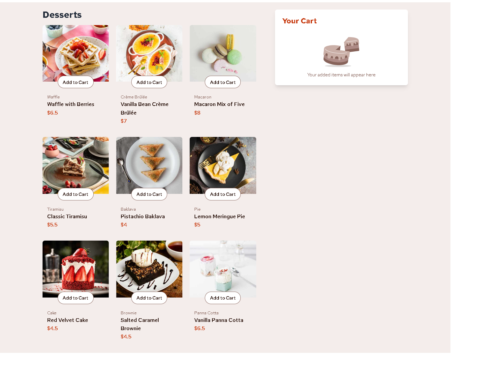

# Frontend Mentor - Product list with cart solution

This is a solution to the [Product list with cart challenge on Frontend Mentor](https://www.frontendmentor.io/challenges/product-list-with-cart-5MmqLVAp_d). Frontend Mentor challenges help you improve your coding skills by building realistic projects. 

## Table of contents

- [Overview](#overview)
  - [The challenge](#the-challenge)
  - [Screenshot](#screenshot)
  - [Links](#links)
  - [Built with](#built-with)
  - [What I learned](#what-i-learned)
- [Author](#author)

**Note: Delete this note and update the table of contents based on what sections you keep.**

## Overview

### The challenge

Users should be able to:

- Add items to the cart and remove them (done)
- Increase/decrease the number of items in the cart (done)
- See an order confirmation modal when they click "Confirm Order" (done)
- Reset their selections when they click "Start New Order" (done)
- View the optimal layout for the interface depending on their device's screen size (done)
- See hover and focus states for all interactive elements on the page  (done)

### Screenshot

### Links

- Solution URL: [Add solution URL here](https://your-solution-url.com)
- Live Site URL: [Add live site URL here](https://your-live-site-url.com)

## My process

### Built with

-html
-tailwind css
-alpine.js
-vanilla.js
-daisyUi(component library)

### What I learned

*clear implemention of  dynamic  alpinejs 
*a basic  tailwind usability .

## Author

- https://github.com/jigsaw1270

**Note: Delete this note and add/remove/edit lines above based on what links you'd like to share.**
